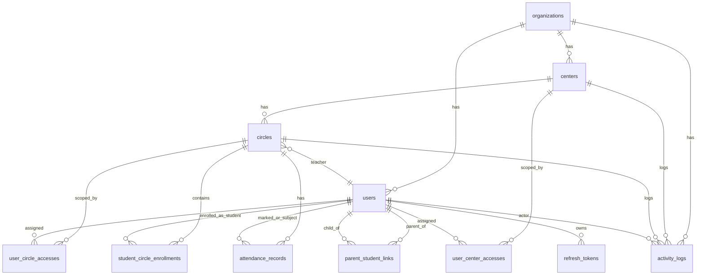

# Rafiq Al-Quran v2 - ERD (2.1)

## Architecture Context
- Pattern: Modular Monolith
- Layers: API/Controller -> Service -> Domain -> Repository -> DB
- DB: MySQL 8 (XAMPP)
- ORM/Migrations: Prisma

## Core Business Scope
- One organization (association) with multiple centers and circles.
- Roles: `SUPER_ADMIN`, `CENTER_ADMIN`, `SUPERVISOR`, `TEACHER`, `PARENT`, `STUDENT`.
- Server-side data scoping enforced by assignment tables.

## ERD (Mermaid)

## Table Specification

### 1) `organizations`
- PK: `id`
- Columns: `name`, `code (UNIQUE)`, `created_at`, `updated_at`
- Constraints: `code` unique

### 2) `centers`
- PK: `id`
- FK: `organization_id -> organizations.id`
- Columns: `name`, `code`, `is_active`, `created_at`, `updated_at`
- Indexes: `organization_id`
- Constraints: `UNIQUE (organization_id, code)`

### 3) `circles`
- PK: `id`
- FK: `center_id -> centers.id`, `teacher_id -> users.id (nullable)`
- Columns: `name`, `is_active`, `created_at`, `updated_at`
- Indexes: `center_id`, `teacher_id`
- Constraints: `UNIQUE (center_id, name)`

### 4) `users`
- PK: `id`
- FK: `organization_id -> organizations.id`
- Columns: `email (UNIQUE)`, `full_name`, `role`, `password_hash`, `is_active`, `created_at`, `updated_at`
- Indexes: `organization_id`, `role`, `is_active`
- Constraints: email unique globally

### 5) `user_center_accesses`
- PK: `id`
- FK: `user_id -> users.id`, `center_id -> centers.id`
- Columns: `created_at`
- Constraints: `UNIQUE (user_id, center_id)`
- Purpose: center-level data scope for `CENTER_ADMIN`, `SUPERVISOR`

### 6) `user_circle_accesses`
- PK: `id`
- FK: `user_id -> users.id`, `circle_id -> circles.id`
- Columns: `created_at`
- Constraints: `UNIQUE (user_id, circle_id)`
- Purpose: circle-level data scope for `SUPERVISOR`, `TEACHER`

### 7) `student_circle_enrollments`
- PK: `id`
- FK: `student_id -> users.id`, `circle_id -> circles.id`
- Columns: `status`, `start_date`, `end_date`
- Indexes: `student_id`, `circle_id`, `status`
- Constraints: `UNIQUE (student_id, circle_id)`

### 8) `parent_student_links`
- PK: `id`
- FK: `parent_id -> users.id`, `student_id -> users.id`
- Columns: `relation_type`, `created_at`
- Indexes: `student_id`
- Constraints: `UNIQUE (parent_id, student_id)`

### 9) `attendance_records`
- PK: `id`
- FK: `student_id -> users.id`, `circle_id -> circles.id`, `marked_by_id -> users.id`
- Columns: `attendance_date`, `status`, `note`, `created_at`
- Indexes: `(circle_id, attendance_date)`, `(student_id, attendance_date)`
- Constraints: `UNIQUE (student_id, circle_id, attendance_date)`

### 10) `refresh_tokens`
- PK: `id`
- FK: `user_id -> users.id`
- Columns: `token_hash (UNIQUE)`, `expires_at`, `revoked_at`, `last_used_at`, `user_agent`, `ip_address`, `created_at`
- Indexes: `user_id`, `expires_at`
- Constraints: hash unique, rotation/revocation supported

### 11) `activity_logs`
- PK: `id`
- FK: `organization_id -> organizations.id`, `user_id -> users.id (nullable)`, `center_id -> centers.id (nullable)`, `circle_id -> circles.id (nullable)`
- Columns: `activity_type`, `entity_type`, `entity_id`, `message`, `metadata(JSON)`, `created_at`
- Indexes: `(organization_id, created_at)`, `(center_id, created_at)`, `(circle_id, created_at)`, `(user_id, created_at)`

## Security/Integrity Constraints
- Passwords stored only as bcrypt hashes.
- Refresh tokens stored as SHA-256 hashes (not plaintext).
- All read APIs apply role-based scope in server logic.
- No trust in frontend role checks.
